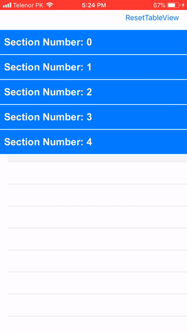
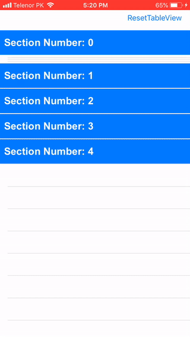

# ARAccordionTableView

[](https://travis-ci.org/ar.warraich@outlook.com/ARAccordionTableView)
[](https://cocoapods.org/pods/ARAccordionTableView)
[](https://cocoapods.org/pods/ARAccordionTableView)
[](https://cocoapods.org/pods/ARAccordionTableView)

## Example
 

## Requirements

- iOS 9.0
- Xcode 11.2
- Swift 5

## Installation

ARAccordionTableView is available through [CocoaPods](https://cocoapods.org). To install
it, simply add the following line to your Podfile:

```ruby
pod 'ARAccordionTableView'
```
Then, run the following command:

```ruby
pod install
```

## How To Use?
### Steps:
You can use  `ARAccordionTableView` in simple three easy steps.
1. Add pod in your PodFile.
2. Change your `UITableView` class with `ARAccordionTableView` 
3. Subclass your `UITableViewHeaderFooterView` with `ARAccordionTableViewHeaderView`


### Different Configuration:
1. Open one section at any time, to achive this set following property like below.
```swift
tableView.allowMultipleSectionsOpen = false
```
and if you want to open multiple sections set value to `true`
```swift
tableView.allowMultipleSectionsOpen = true
```
2. Set `keepOneSectionOpen` property to `true` to keep one section open all the time 
```swift
tableView.keepOneSectionOpen = true
```
3. Open specific sections on start like below.

```swift
tableView.initialOpenSections = [1,3]
```
4. To check if section is open or close 
```swift
let isSection = tableView.isSectionOpen(1)
```
5. To toggle section use following function
```swift
tableView.toggleSection(1)
```
6. To close all sections 
```swift
tableView.closeAllSections()
```

### ARAccordionTableViewDelegate:
```swift
extension ViewController : ARAccordionTableViewDelegate {

func tableView(_ tableView: ARAccordionTableView, canInteractWithHeaderAtSection section: Int) -> Bool {
//Return whether user can interact with header View
return true
}

func tableView(_ tableView: ARAccordionTableView, willOpenSection section: Int, withHeader header: UITableViewHeaderFooterView?) {

// called before section is opening
}

func tableView(_ tableView: ARAccordionTableView, didOpenSection section: Int, withHeader header: UITableViewHeaderFooterView?) {
// called after section opened
}

func tableView(_ tableView: ARAccordionTableView, willCloseSection section: Int, withHeader header: UITableViewHeaderFooterView?) {
// called before section closes
}

func tableView(_ tableView: ARAccordionTableView, didCloseSection section: Int, withHeader header: UITableViewHeaderFooterView?) {
// called after section closed
}

func tableView(_ tableView: ARAccordionTableView, didLogPressedSection section: Int, withHeader header: UITableViewHeaderFooterView?, longPressGestureState state: UIGestureRecognizer.State) {

// called when user long press on a tableView header
}
}
```
## Author

AbdulRehman Warraich, ar.warraich@outlook.com

ARAccordionTableView is based on [FZAccordionTableView](https://github.com/fuzz-productions/FZAccordionTableView).

## License

ARAccordionTableView is released under the MIT license. [See LICENSE](https://github.com/AbdulRehmanWarraich/ARAccordionTableView/blob/master/LICENSE) for details.
